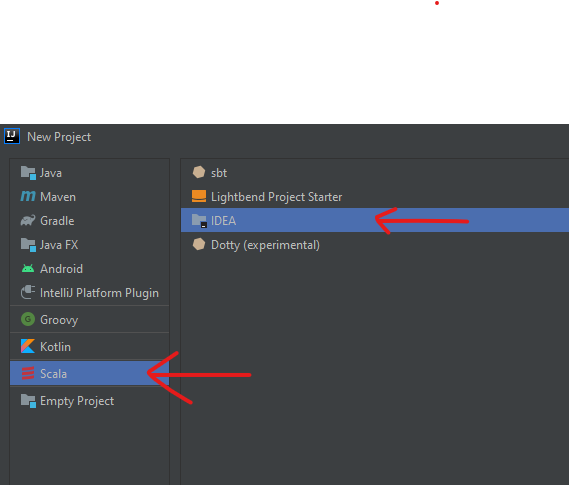

# Assignment 2
#### Dr. Dan Lo
#### Terry Strickland
###### Fall Semester 2020 :shipit:

## Objective
Write a Scala program that take **covtype.data** file as **input**\
and **output** the "prediction" of the "type of forest" on a piece of land

### Input Data
- Download the [data here](https://archive.ics.uci.edu/ml/machine-learning-databases/covtype/)
- Read the **covtype.info**

so you don't have high blood pressure from trying to understand what the code is doing with this data! I'm telling you, "machine learning" is probably one of the biggest factor that causes the slowdown of advancement for humankind
because of all the convoluted WORDS that are thrown around in the community, which makes it SO HARD for people to learn and understand machine learning.

### Output Data
"The target itself is a categorical value encoded as the values 1 to 7"\
(7 values/targets)

"confusionMatrix"\
" the correct predictions are the counts along the diagonal"\

### JDK, SDK requirements, Setup

```
C:/Users/ <username> /.jdks/openjdk-14.0.2-1
 ```
 
- openjdk-14.0.2-1
- IntelliJ community edition 2020.2.1
- scala-sdk-2.12.10

#### intelli J Set up
New Project >> Scala (IDEA** based Scala project) \


## Source code
Source code on Github click [HERE](https://raw.githubusercontent.com/wire2coder/fall2020/master/src/com/learningspark/example/WordCount.scala)


## Outputs and Screenshots :thumbsup:

What type of forest is on this piece of land?

### Screeshot


### Console Output

