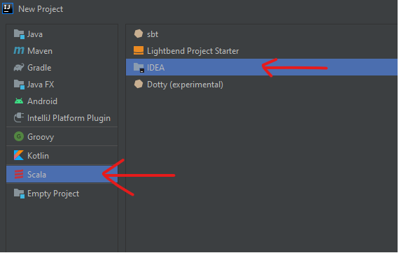
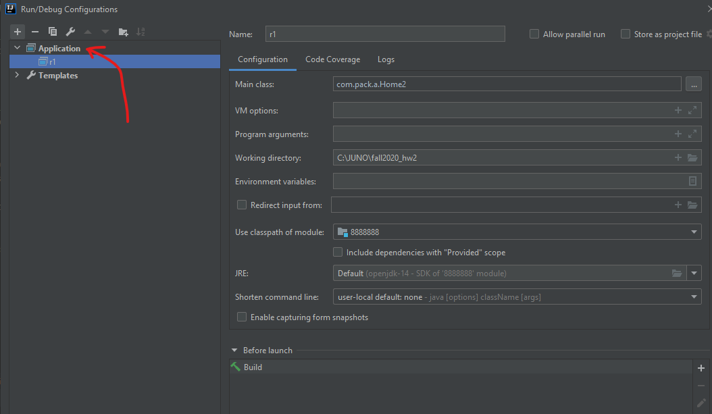

# Assignment 2
#### Dr. Dan Lo
#### Terry Strickland
###### Fall Semester 2020 :shipit:

## Objective
Write a Scala program that take **covtype.data** file as **input** <br />
and **output** the "prediction" of the "type of forest" on a piece of land

### Input Data
- Download the [data here](https://archive.ics.uci.edu/ml/machine-learning-databases/covtype/)
- Read the **covtype.info**

##### About Input Data
This 'data set' recorded the TYPES OF FOREST that are covering plots of lands in Colorado, USA. <br />
Each 'sample' of the data set looks like this: <br /> <br />
``` 2596,51,3,258,0,510,221,232,148,6279,1,0,0,0,0,0,0,0,0,0,0,0,0,0,0,0,0,0,0,0,0,0,0,0,0,0,0,0,0,0,0,0,1,0,0,0,0,0,0,0,0,0,0,0,5 ```

this is one line in the 'covtype.dat' file, each line is a 'sample' <br />
a 'sample' has 55 columns: 0 to 54 <br />
581012 rows (samples): 0 to 581011 <br /> <br />

column 0 to 9 has the following 'attribute'
```
 #   Column                              Non-Null Count   Dtype
---  ------                              --------------   -----
 0   Elevation                           581012 non-null  int64
 1   Aspect                              581012 non-null  int64
 2   Slope                               581012 non-null  int64
 3   Horizontal_Distance_To_Hydrology    581012 non-null  int64
 4   Vertical_Distance_To_Hydrology      581012 non-null  int64
 5   Horizontal_Distance_To_Roadways     581012 non-null  int64
 6   Hillshade_9am                       581012 non-null  int64
 7   Hillshade_Noon                      581012 non-null  int64
 8   Hillshade_3pm                       581012 non-null  int64
 9   Horizontal_Distance_To_Fire_Points  581012 non-null  int64
```

column 10 to 11, each of the column represent a binary number 0/1, so all 4 columns together represents 4 bits binary number  
this technique has a name that is very descriptive and easy to understand, ONE HOT encoding
```
 10  Wilderness_Area1                    581012 non-null  int64
 11  Wilderness_Area2                    581012 non-null  int64
 12  Wilderness_Area3                    581012 non-null  int64
 13  Wilderness_Area4                    581012 non-null  int64
```
columns 14 to 53 is also the ONE HOT encoding columns for the Soil_Type 
```
 14  Soil_Type1                          581012 non-null  int64
 15  Soil_Type2                          581012 non-null  int64
 16  Soil_Type3                          581012 non-null  int64
 17  Soil_Type4                          581012 non-null  int64
```

the last column, column 54, is the CORRECT ANSWER for each row (sample), the 'Type of Forest' that are covering the land, and its attribute values are in column 0 to 53
```
 54  Cover_Type                          581012 non-null  int64
```

There are 7 possible answer for column 54
```
Forest Cover Type Classes:	    1 -- Spruce/Fir
                                2 -- Lodgepole Pine
                                3 -- Ponderosa Pine
                                4 -- Cottonwood/Willow
                                5 -- Aspen
                                6 -- Douglas-fir
                                7 -- Krummholz
```

You can read the 'covtype.info' for a lot more details related to the 'data set'


### Output Data
There are 7 possible answer for column 54
```
Forest Cover Type Classes:	    1 -- Spruce/Fir
                                2 -- Lodgepole Pine
                                3 -- Ponderosa Pine
                                4 -- Cottonwood/Willow
                                5 -- Aspen
                                6 -- Douglas-fir
                                7 -- Krummholz
```

"confusionMatrix" <br />
" the correct predictions are the counts along the diagonal" <br />

For each row (sample), we are using the simple DECISION TREE algorithm to predicts the 'TYPE OF FOREST' ( 1 to 7). <br />
First we split the 'data set' into 3 different sets:
 
- 'training set' 
- 'cross validation set' 
- 'test set'

We input 'training set' and 'cross validation set' into the algorithm to 'train' it, after that we input the 'test set' into the algorithm
and see how many correct answers the algorithm gives us.

### JDK, SDK requirements, Setup

```
C:/Users/ <username> /.jdks/openjdk-14.0.2-1
 ```
 
- openjdk-14.0.2-1
- IntelliJ community edition 2020.2.1
- scala-sdk-2.12.10

#### intelli J Set up
New Project >> Scala (IDEA** based Scala project) <br />
 <br />
<br />

intelli J, run configuration <br />
 <br />

## Source code
Source code on Github click [HERE](https://github.com/wire2coder/fall2020_hw2/blob/master/src/com/pack/a/Home2.scala)

```
package com.pack.a

import org.apache.log4j.{Level, Logger}
import org.apache.spark.mllib.evaluation.MulticlassMetrics
import org.apache.spark.mllib.linalg.Vectors
import org.apache.spark.mllib.regression.LabeledPoint
import org.apache.spark.mllib.tree.{DecisionTree, RandomForest}
import org.apache.spark.mllib.tree.model.DecisionTreeModel
import org.apache.spark.rdd.RDD
import org.apache.spark.{SparkConf, SparkContext}

object Home2 {

  def getMetrics(model: DecisionTreeModel, data: RDD[LabeledPoint]): MulticlassMetrics = {
    val predictionsAndLabels = data.map(example =>
      (model.predict(example.features), example.label)
    )
    new MulticlassMetrics(predictionsAndLabels)

  } // def getMetrics()


  // main() function
  def main( args: Array[String] ) {

    // set the log level
    Logger.getLogger("org").setLevel(Level.ERROR)

    // make new 'sc' object thing
    val sc = new SparkContext( new SparkConf().setAppName("RDF").setMaster("local") )

    // read the file
    val rawData = sc.textFile("./covtype.data")
//    rawData.foreach(println)

    val data = rawData.map { line =>
      val values = line.split(',').map(_.toDouble)
      val featureVector = Vectors.dense(values.init)
      val label = values.last - 1
      LabeledPoint(label, featureVector)
    }

    // Split into 80% train, 10% cross validation, 10% test
    val Array(trainData, cvData, testData) = data.randomSplit(Array(0.8, 0.1, 0.1))

    // "cache data to RAM"
    trainData.cache()
    cvData.cache()
    testData.cache()


    // Build a simple default DecisionTreeModel and compute precision and recall
    //    simpleDecisionTree(trainData, cvData)
    val model = DecisionTree.trainClassifier(trainData, 7, Map[Int,Int](), "gini", 4, 100)
    val metrics = getMetrics(model, cvData)

    println("\n Printing the PRECISION VALUE for each 'Class' \n")
    for ( asdf <-  0 to 6) {  // we have total of 7 'classes'
      println("Class " + asdf + " with precision value: " + metrics.precision(asdf) )
    }

    println("\n Printing the CONFUSION MATRIX \n")
    println(metrics.confusionMatrix)


    // remove data from RAM?
    trainData.unpersist()
    cvData.unpersist()
    testData.unpersist()

    println(" ")
    println("Main function() finished running, yay!")

  } // def main()


} // Object Home2
```


## Outputs and Screenshots :thumbsup:

What type of forest is on this piece of land? <br />
Output also includes the "CONFUSION MATRIX"

```
Printing the PRECISION VALUE for each 'Class' 

Class 0 with precision value: 0.6846204996675216
Class 1 with precision value: 0.7269916688362406
Class 2 with precision value: 0.6246654313362158
Class 3 with precision value: 0.36363636363636365
Class 4 with precision value: 0.7222222222222222
Class 5 with precision value: 0.0
Class 6 with precision value: 0.6779279279279279

 Printing the CONFUSION MATRIX 

14414.0  6578.0   10.0    3.0    0.0   0.0  380.0  
5439.0   22339.0  435.0   21.0   5.0   0.0  49.0   
0.0      401.0    3034.0  88.0   0.0   0.0  0.0    
0.0      0.0      158.0   112.0  0.0   0.0  0.0    
0.0      936.0    26.0    0.0    13.0  0.0  0.0    
0.0      444.0    1194.0  84.0   0.0   0.0  0.0    
1201.0   30.0     0.0     0.0    0.0   0.0  903.0  
 
Main function() finished running, yay!

Process finished with exit code 0
```

